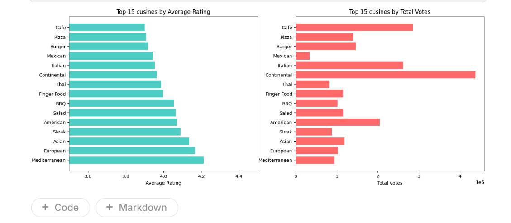
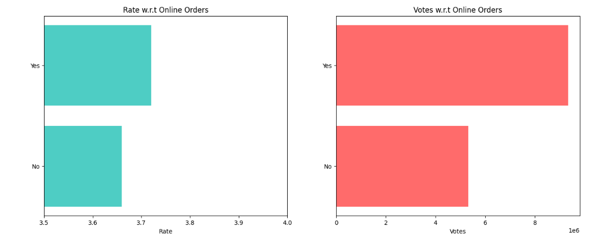
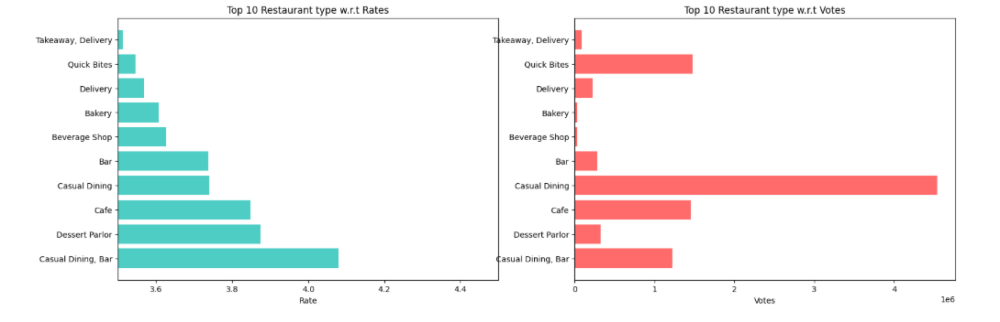
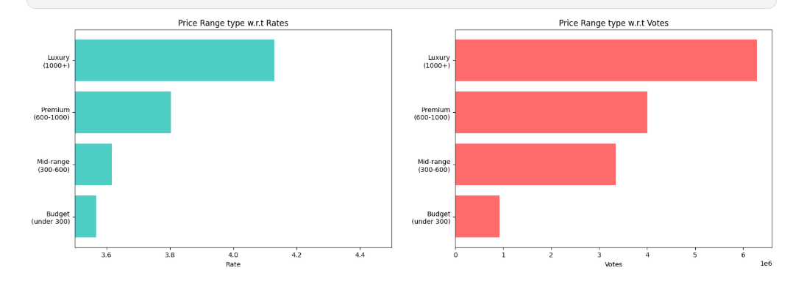
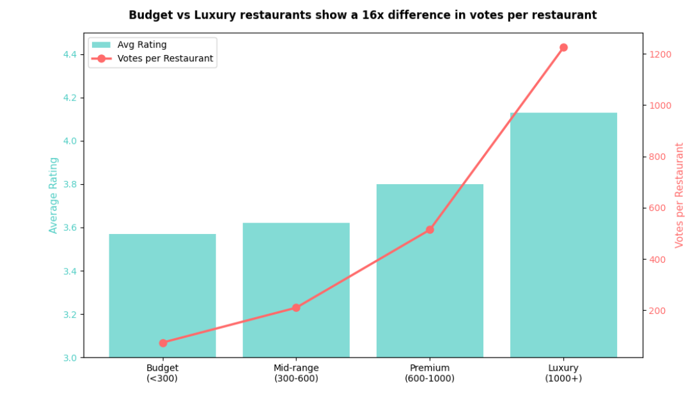

# Restaurant Analytics — What Makes a Restaurant Successful on Zomato?
### Bangalore Food Market Analysis | Python • Pandas • Matplotlib

## Project Overview
This project analyses 40,000+ restaurants on Zomato Bangalore to 
identify what separates high-performing restaurants from low-performing 
ones across cuisine, pricing, location, restaurant type, and online 
presence.

**Central Question:** What factors most strongly predict a restaurant's 
rating and customer engagement on Zomato?

---

## Dataset
- **Source:** [Zomato Bangalore Restaurants](https://www.kaggle.com/datasets/himanshupoddar/zomato-bangalore-restaurants) — Kaggle
- **Size:** 51,717 restaurants, 17 columns
- **Coverage:** Multiple areas across Bangalore
- **Key columns:** Rating, Votes, Cuisine, Location, Restaurant Type, 
  Cost for Two, Online Order, Book Table

---

## Tools & Technologies
- Python 3
- Pandas — data cleaning and analysis
- Matplotlib — data visualization
- Jupyter Notebook

---

## Data Cleaning
Real-world issues handled before analysis —
- `rate` column stored as string `"4.1/5"` — extracted numeric value 
  and converted to float
- `approx_cost` column had comma-formatted strings like `"1,200"` — 
  removed commas and converted to numeric
- `NEW` entries in rate column replaced with NaN
- Null rate rows dropped (15% of data) after confirming majority had 
  no recoverable review data

---

## Project Structure
```
├── zomato_restaurant_analytics.ipynb
├── finding1_cuisine_analysis.png
├── finding2_online_orders.png
├── finding3_restaurant_type.png
├── finding4_pricing_analysis.png
├── finding5_location_analysis.png
└── README.md
```

---

## Key Findings

### Finding 1 — Popular Cuisines Are Not the Highest Rated
Mediterranean and European cuisines rate highest (4.2+) but Continental 
dominates total votes at 4.3M+. A restaurant must consciously choose 
between quality positioning and volume — the data shows these rarely 
overlap.



---

### Finding 2 — Online Ordering Drives 75% More Engagement
Restaurants accepting online orders attract 9.3M votes vs 5.3M for 
those that don't — a 75% difference. Rating is also slightly higher 
(3.72 vs 3.66). Online presence is a visibility and engagement strategy, 
not just a convenience feature.



---

### Finding 3 — Restaurant Type Reveals Quality vs Volume Trade-off
Casual Dining + Bar rates highest at 4.08 while Delivery and Quick 
Bites rate lowest at 3.55–3.57. High footfall formats trade experience 
quality for volume. Delivery restaurants suffer because experience 
quality depends on logistics outside their control.



---

### Finding 4 — Premium Pricing Creates a 16x Engagement Advantage
Luxury restaurants (1000+ for two) average 1,225 votes each vs just 
74 for budget restaurants — a 16x difference. Higher spend attracts 
more engaged reviewers, creating a compounding visibility advantage 
for premium positioned restaurants.



---

### Finding 5 — Location Reflects the Premium Positioning Pattern
Lavelle Road (4.14) and Koramangala blocks dominate top ratings. 
Peripheral IT corridors like Electronic City (3.49) and Marathahalli 
(3.54) consistently underperform. Premium central locations attract 
higher spending, more engaged customers.



---

## Business Recommendations

**1. Enable online ordering immediately**
It is the single lowest-cost action any restaurant can take to 
increase visibility. The 75% vote gap is too large to ignore.

**2. Consider premium positioning over budget**
The data shows a compounding advantage — higher price attracts more 
engaged reviewers which attracts more customers. Budget positioning 
on Zomato creates a visibility disadvantage that is hard to overcome.

**3. Invest in sit-down experience over delivery**
Casual Dining consistently outrates Delivery formats. Restaurants 
that control the end-to-end dining experience earn significantly 
better ratings.

**4. Location selection matters significantly**
Koramangala and central Bangalore locations outperform peripheral 
areas by a meaningful margin. For new restaurants, location is a 
ratings strategy, not just a real estate decision.

**5. Cuisine selection depends on your goal**
Mediterranean and European for premium rating positioning. 
Continental and Café for maximum customer volume.

---

## Analytical Approach
1. Cleaned rate and cost columns from string formats to numeric
2. Handled null values with documented business reasoning
3. Applied minimum volume filters before groupby analysis to avoid 
   misleading results from low-sample categories
4. Built five independent analyses each answering one business question
5. Connected findings into a single narrative about what drives 
   restaurant success

---

## What I Learned
This project taught me that real-world data always needs cleaning 
before analysis — and that cleaning decisions require business 
reasoning, not just technical fixes.

The most interesting finding was the 16x votes per restaurant gap 
between luxury and budget — a pattern that only emerged after 
normalising by restaurant count rather than looking at raw totals. 
Raw numbers can be misleading without the right denominator.

## About
Zomato Bangalore restaurant analysis exploring what drives ratings 
and customer engagement across 40,000+ restaurants.
